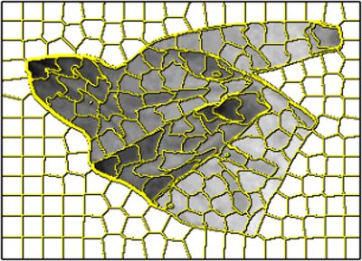
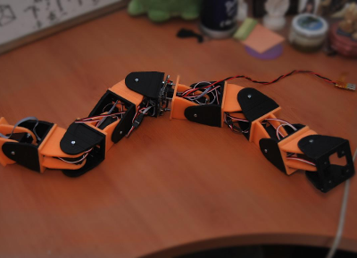
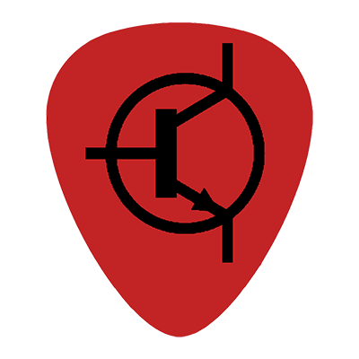
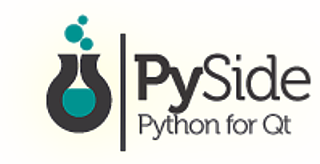
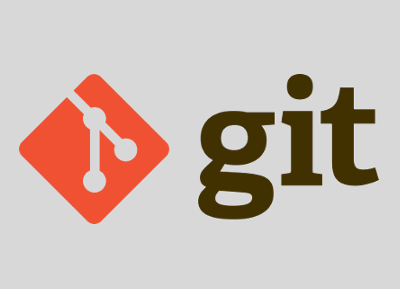

  

    
  

  

    
Electronics Engineer with a M.Sc in Robotics. I am currently working on my Ph.D at University Carlos III of Madrid, researching about garment perception and manipulation applied to robotics (i.e. teaching a robot how to do the laundry). My research interests are Computer Vision, Robotics, and Mixed Reality applied to robots.

  

  

  
      <a class="no_icon" href="{{element.url}}">
      
            <i class="fa fa-circle fa-stack-2x text-primary"></i>
            <i class="fa fa-{{element.title}} fa-stack-1x fa-inverse"></i>
      
      </a>
  
  

<!-- Service Tabs -->

    

    

    

        <ul id="myTab" class="nav nav-tabs nav-justified">
            <li class="active"><a href="#service-blog" data-toggle="tab"><i class="fa fa-edit"></i> Blog</a>
            </li>
            <li class=""><a href="#service-research" data-toggle="tab"><i class="fa fa-search"></i> Research</a>
            </li>
            <li class=""><a href="#service-projects" data-toggle="tab"><i class="fa fa-code"></i> Projects</a>
            </li>
            <li class=""><a href="#service-tutorials" data-toggle="tab"><i class="fa fa-map-signs"></i> Tutorials</a>
            </li>
        </ul>

        

            

                <h4 class="no-anchor">Blog</h4>
                
A place to share stories, technical posts, or very much anything that might occur to me. Currently only in Spanish, though  <a href="https://github.com/David-Estevez/David-Estevez.github.io/issues/3">I'd like to offer an English version</a> in the future.

                <!-- Service List -->
                

                  

                      <h2 class="page-header no-anchor">Recent Posts</h2>
                  

                  
                  

                      

                          

                              
                                
                              
                              
                                    <i class="fa fa-circle fa-stack-2x text-primary"></i>
                                    <i class="fa fa-edit fa-stack-1x fa-inverse"></i>
                              
                              
                          

                          

                              <h4 class="no-anchor">{{ post.title }}</h4>
                              
 {{ page.summary | strip_html | strip_newlines | truncate: 40 }}  {{ post.content | truncatewords: 40 | strip_html }} 

                              <a href="{{ post.url | remove: "/" }}" class="btn btn-primary">Read Post</a>
                          

                      

                  

                  
                  

                      

                          

                              
                                    <i class="fa fa-circle fa-stack-2x text-primary"></i>
                                    <i class="fa fa-edit fa-stack-1x fa-inverse"></i>
                              
                          

                          

                              <h4 class="no-anchor">Latest Posts</h4>
                              
Check out the latest posts published on the blog.

                              <a href="news.html" class="btn btn-primary">Check Out!</a>
                          

                      

                  

                

            

            

                <h4 class="no-anchor">Research</h4>
                
A section devoted to sharing information and resources related with my research in the field of robotics.

                <!-- Service List -->
                

                  

                      <h2 class="page-header no-anchor">Research Lines</h2>
                  

                  

                    

                        

                          
                        

                        

                          <h4 class="media-heading no-anchor">Garment Perception and Manipulation</h4>
                          
When robots do laundry.

                          <a href="research.html" class="btn btn-primary">View topic</a>
                        

                    

                  

                  

                    

                        

                          
                        

                        

                          <h4 class="media-heading no-anchor">Modular Robots</h4>
                          
When robots are made of robots.

                          <a href="research.html" class="btn btn-primary">View topic</a>
                        

                    

                  

                   (To be enabled in the future)
                  

                    

                        

                            
                                  <i class="fa fa-circle fa-stack-2x text-primary"></i>
                                  <i class="fa fa-search fa-stack-1x fa-inverse"></i>
                            
                        

                        

                            <h4 class="no-anchor">Publications</h4>
                            
List of all my academic publications.

                            <a href="404.html" class="btn btn-primary">View publications</a>
                        

                    

                  

                  
                

            

            

                <h4 class="no-anchor">Projects</h4>
                
This section contains my personal hobby projects, including the projects I contribute to in <a href="https://asrob.uc3m.es/">ASROB</a> and <a href="https://music.uc3m.es/">UC3Music</a>.

                <!-- Service List -->
                

                  

                    <h2 class="page-header no-anchor">Categories</h2>
                  

                  

                    

                        

                            
                                  <i class="fa fa-circle fa-stack-2x text-primary"></i>
                                  <i class="fa fa-code fa-stack-1x fa-inverse"></i>
                            
                        

                        

                          <h4 class="media-heading no-anchor">Personal Projects</h4>
                          
Projects I make in my spare time for fun.

                          <a href="projects.html" class="btn btn-primary">View Projects</a>
                        

                    

                  

                  

                    

                        

                          
                        

                        

                          <h4 class="media-heading no-anchor">Projects at ASROB</h4>
                          
Projects I contribute to in the UC3M Robotics Society (ASROB).

                          <a href="projects.html" class="btn btn-primary">View Projects</a>
                        

                    

                  

                  

                    

                        

                          
                        

                        

                          <h4 class="media-heading no-anchor">Projects at UC3Music</h4>
                          
Projects I contribute to in the UC3M Music and Engineering Society (UC3Music).

                          <a href="projects.html" class="btn btn-primary">View Projects</a>
                        

                    

                  

                

            

            

              <h4 class="no-anchor">Tutorials</h4>
              
This section contains tutorials for several topics that I made for the future me, but could be useful for other people too.

              <!-- Service List -->
              

                

                    <h2 class="page-header no-anchor">Featured Tutorials</h2>
                

                

                  

                      

                        
                      

                      

                        <h4 class="media-heading no-anchor">PyQt/PySide</h4>
                        
Creating a PySide GUI application.

                        <a href="https://david-estevez.gitbooks.io/tutorial-pyside-pyqt4/content/" class="btn btn-primary no_icon">View Tutorial</a>
                      

                  

                

                

                  

                      

                        
                      

                      

                        <h4 class="media-heading no-anchor">The Git, the Bad and the Ugly</h4>
                        
Git for beginners (Spanish only).

                        <a href="https://david-estevez.gitbooks.io/the-git-the-bad-and-the-ugly/content/es/" class="btn btn-primary no_icon">View Tutorial</a>
                      

                  

                

                 (To be enabled in the future)
                

                  

                      

                          
                                <i class="fa fa-circle fa-stack-2x text-primary"></i>
                                <i class="fa fa-map-signs fa-stack-1x fa-inverse"></i>
                          
                      

                      

                          <h4 class="no-anchor">All Tutorials</h4>
                          
List of all my tutorials.

                          <a href="404.html" class="btn btn-primary">View Tutorials</a>
                      

                  

                

                
              

            

        

    


